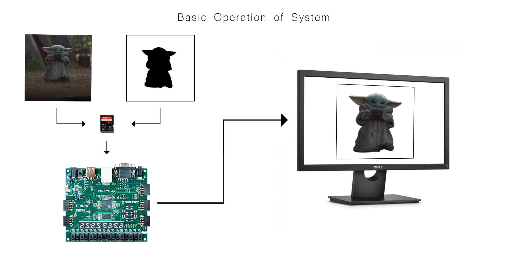

# Image Mask Accelerator 

**Lock, Matthew (LCKMAT002) | Jaffer, Mahmoodah (JFFMAH001) | Godfrey, Lawrence (GDFLAW001) | Barbas, Luca (BRBLUC001)**

<a name="figure-1">

</a><div align="center"> Figure 1 : Illustration of Image Masking</div>

## Project Description

This project implements an image masking algorithm on a Nexys A7 100T FPGA. The image masking works by taking two images, and overlaying one image over another according to to the provided image mask. An example of this can be seen in [Figure 1](#figure-1). The system is then able to display the result to a screen over a VGA connection. The reason for doing this was to make use of the parallel nature of the FPGA to accelerate the task of image masking, which itself is an embarrasingly parallel task. While speedups over a golden measure were not achieved, parallel approaches are considered and prove to have massive potential in for this application. The full report can be found under:

```
Image-Masking-Accelerator
|-- final_ima
    |-- IMA_YODA_Final_Report.pdf
```

## Image Requirements

The accelerator requires that any input image or mask must be a 12-bit image with 320x240 resolution. We understand that these images are not readily available, and does not work should the user want to work with their own images. Hence an image converter has been created to handle this for the user. It is suggested that all images are at least the same resoltion so that the downscaling is consistent between images. Furthermore, this has been integrated into the script which uploads images onto the FPGA, but the script can also be accessed manually and converted into a .coe file for initialising BRAM modules. The script can be found in :

```
Image-Masking-Accelerator
|-- image_converter
```

*A readme is provided on how to use the script*

## Source Code

The code for the final implementation of the accelerator can be found in :

```
Image-Masking-Accelerator
|-- final_ima
    |-- hdl
```
