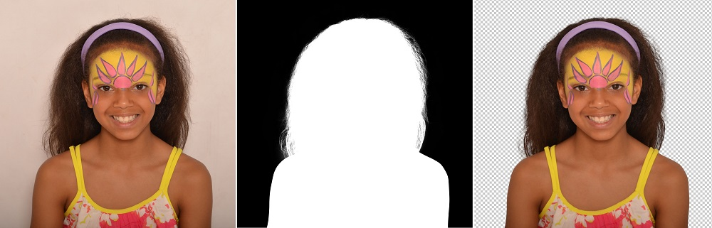

# Image Masking Accelerator Proposal Blog

**Lock, Matthew (LCKMAT002) | Jaffer, Mahmoodah (JFFMAH001) | Godfrey, Lawrence (GDFLAW001) | Barbas, Luca (BRBLUC001)**

Digital Dynamo (Team leader) : Lock, Matthew | Writer of words: Mahmoodah Jaffer | Manipulator of pixels: Lawrence Godfrey |  Finder of Computer Components: Barbas, Luca

---

<a name="banner">

# Project Description

Image masking is a bitwise graphics processing tool used to hide, reveal, or overlay certain portions of an image. Another use of image masking is for for image filtering or edge detection [1]. The problem of focus for this project is to develop an image masking accelerator (IMA) to perform XOR masking. The IMA must perform masking on at least one image-mask pair stored on an SD card to hide a portion of the image as described by the image mask. If time permits, a secondary feature will be implemented to allow for the overlaying of one image over another. An  example of this secondary feature can be found in [Figure 3](#figure-13). The resulting image produced by the IMGA will be displayed to a screen using a VGA interface.

An example of an image mask be can seen in the second image of [Figure 1](#figure-1) where the image mask is a black (represented by 0s to show an inactive pixel) and white (represented by 1s to show an activated pixel ) image with the same dimensions as the unmasked image. When executing   XOR operations on the unmasked image, the mask should restrict the resulting image to the corresponding pixels that are 0 (black) in the mask, thereby restricting the resulting image and removing certain parts of the original image[2]. Notice how the white side of the image in [Figure 1](#figure-1) is restricted to the corresponding black pixels of the mask, while the corresponding white part is removed from the image. Ideally the black pixels on the right side of the image should remain black as there is nothing to remove. Unfortunately due to the nature of XOR operations there is an unintended consequence. As seen, a portion gets added to the right side of the image. This is in inherent limitation of XOR image masking and will require some additional processing to remove pure black pixels from the original image.  A more natural graphical representation of XOR image masking can be seen in [Figure 2](#figure-2).

 Figure 1 : Illustration of XOR image masking

<a name="figure-2">

 Figure 2 : Process of bitwise XOR image masking

# Plan A

Due to the current COVID-19 pandemic, there are foreseeable as well as unpredictable limitations attached to this project. These include but are not limited to increased difficulty in approaching lectures and tutors for advice, limitations on how many people in the group have access to an FPGA, as well as the inherent difficulties associated with distance group work and hardware testing. In order to account for all possible limitations, we have provided specifications for two potential implementations of the IMA. The final design of the IMA is set to at least meet the core specifications and functionality laid out in plan B. Plan A is the best case design scenario where the afforded time allows for the complete implementation of the IMA's core function, as well as proposed  additional functions. 

## Proposed Solution

The IMA will be implemented on the Nexys A7-100T board, allowing the the user to load uncompressed 12-bit RGB colour images and image masks, at a resolution of 320 x 240, into appropriate directories on an SD card. On start up, the system will verify that an SD card has been inserted and that there are at least two images ready to be masked, and at least one image mask present . If the verification is successful, the system will overlay the first image found in the directory with the second (as shown in [Figure 3](#figure-3)) using the first image mask found. The XOR operations will be implemented in a similar manner described by Rishabh Singh[3] with pixel activation being determined by a logical OR operation. The final masked image will then be displayed to a VGA interface using the methods found **Section 8.1** of the Nexys A7 reference guide [4] and timing specifications described by B, Eater [5]. Further more, the user will be able to switch between which images are to be used for overlaying, and which mask will be used. Buttons for each of the three image options will be implemented to cycle through the available images.

<a name="figure-3">

 Figure 3 : Process of overlaying of images using image masking

## Prototype Specification

- The SD card will not be simulated
- The system will be be compatible with 12-bit RGB colour images at a resolution of 320 x 240
- The result of the image masking operation will be displayed on a display over a VGA interface
- The user input consists of 3 buttons:
    - Cycle through images on which overlay will occur
    - Cycle through images which will overlay the first image
    - Cycle through image masks

 

## Criteria for Acceptable Solution

- System loads images from the SD card
- System performs required XOR operations to perform image overlaying
- Video display adapter successfully displays image to monitor over VGA interface
- Input creteria:
    - User is able to cycle through images on which overlay will occur
    - User is able to cycle through images which will overlay the first image
    - User is able to cycle through image masks

# Plan B

## Proposed Solution

The IMA will be implemented on the Nexys A7-100T board, allowing the the user to load one uncompressed 12-bit RGB colour image-mask pair onto a simulated SD card (BRAM). The system will determine which pixels are activated by means of a logical OR operation, and will then apply the image mask to the image using a XOR operation described by Rishabh Singh [3] and shown in [Figure 1](#figure-4). The processed image will then be displayed to a VGA interface using the methods found **Section 8.1** of the Nexys A7 reference guide [4] and timing specifications described by B, Eater [5].

<a name="figure-4">

 Figure 4 : Process of simple image masking using XOR operations

## Prototype Specification

- The SD card will be simulated on BRAM
- There will be only one 12-bit RGB colour image and image mask in memory  at a resolution of 320 x 240
- The result of the image masking operation will be displayed on a display over a VGA interface

## Criteria for Acceptable Solution

- System loads image and image mask from the simulated SD card
- System performs required XOR operations to perform image masking
- System can store image, image mask and result in BRAM
- Video display adapter successfully displays image to monitor over VGA interface

# Work Breakdown Structure

In order to work as effectively as possible in a situation where only two of our members have access to FPGAs, we have carefully allocated different responsibilities and tasks to the most appropriate team members. Where development requires extensive hardware testing, those with access an FPGA have been assigned. Development through benchmark testing has been assigned to members without access to an FPGA. Weekly meetings have scheduled in order to keep up with all the preset deadlines, with adjustments to the work breakdown structure taking place as needed. The initial work breakdown structure can be found below

**Initial Work Breakdown Structure**:
| Member                 | Responsibilities   |	Access to FPGA | 
| :------------------------ | :-------------| :-------------|
| Matthew Lock           | VGA Video Card Adapter | Yes
| Lawrence Godfrey       | VGA Video Card Adapter | Yes
| Mahmoodah Jaffer       | <ul><li>Implementation of SD and Memory Controller</li><li>Input Operation : Image Cycling</li></ul>| No
| Luca Barbas       | <ul><li>XOR Operation and result storing</li><li>Additional Research</li></ul>| No

# Bibliography

[1] “Concept of Mask.” Tutorialspoint Available:  [www.tutorialspoint.com/dip/concept_of_masks.htm](http://www.tutorialspoint.com/dip/concept_of_masks.htm). [Accessed 5 May 2020]

[2] "Mask (computing)", 21 April 2020 [Online] Available: [https://en.wikipedia.org/wiki/Mask_(computing)#Image_masks](https://en.wikipedia.org/wiki/Mask_(computing)#Image_masks) . [Accessed 29 April 2020]

[3] Singh,Rishabh. "Arithmetic Operations on Images using OpenCV | Set-2 (Bitwise Operations on Binary Images)"[Online] Available: [https://www.geeksforgeeks.org/arithmetic-operations-on-images-using-opencv-set-2-bitwise-operations-on-binary-images/](https://www.geeksforgeeks.org/arithmetic-operations-on-images-using-opencv-set-2-bitwise-operations-on-binary-images/) .[Accessed 29 April 2020]

[4] “Nexys A7 Reference Manual.” Nexys A7 Reference Manual [Online] Available: [Reference.Digilentinc], [reference.digilentinc.com/reference/programmable-logic/nexys-a7/reference-manual](http://reference.digilentinc.com/reference/programmable-logic/nexys-a7/reference-manual). [Accessed 7 May 2020]

[5] B, Eater. "The world's worst video card?", 5 July 2019 [Online] Available: [https://www.youtube.com/watch?v=l7rce6IQDWs](https://www.youtube.com/watch?v=l7rce6IQDWs) [Accessed 10 May 2020]
